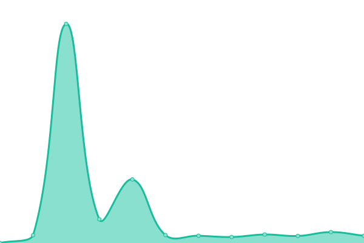
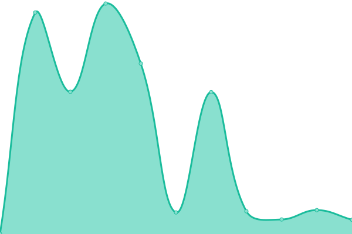
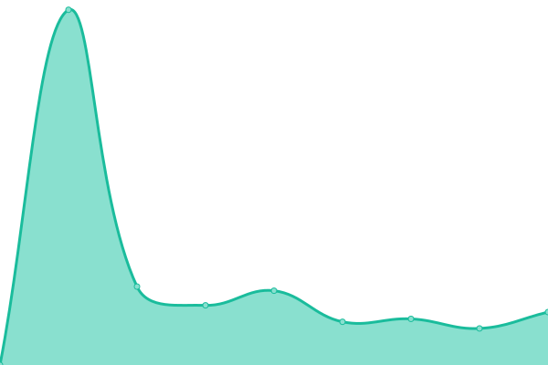
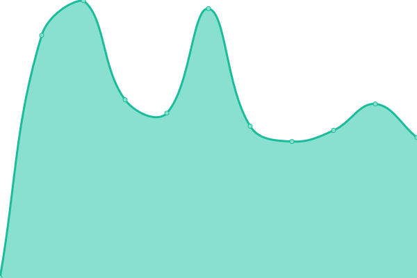

# [📈 Live Status](https://status.notakrista.com): <!--live status--> **🟩 All systems operational**

This repository contains the open-source uptime monitor and status page for [Jorge Thomas - Akrista](notakrista.com), powered by [Upptime](https://github.com/upptime/upptime).

With [Upptime](https://upptime.js.org), you can get your own unlimited and free uptime monitor and status page, powered entirely by a GitHub repository. We use [Issues](https://github.com/akrista/status.notakrista.com/issues) as incident reports, [Actions](https://github.com/akrista/status.notakrista.com/actions) as uptime monitors, and [Pages](https://status.notakrista.com) for the status page.

<!--start: status pages-->
<!-- This summary is generated by Upptime (https://github.com/upptime/upptime) -->
<!-- Do not edit this manually, your changes will be overwritten -->
<!-- prettier-ignore -->
| URL | Status | History | Response Time | Uptime |
| --- | ------ | ------- | ------------- | ------ |
|  [Main Website](https://www.notakrista.com) | 🟩 Up | [main-website.yml](https://github.com/akrista/status.notakrista.com/commits/HEAD/history/main-website.yml) | 

 811ms
     
 | 

<a href="https://status.notakrista.com/history/main-website">100.00%</a>
    

|  [Blog & Wiki](https://rockery.notakrista.com) | 🟩 Up | [blog-and-wiki.yml](https://github.com/akrista/status.notakrista.com/commits/HEAD/history/blog-and-wiki.yml) | 

 873ms
     
 | 

<a href="https://status.notakrista.com/history/blog-and-wiki">100.00%</a>
    

|  [Dashboards](https://metabase.notakrista.com/) | 🟩 Up | [dashboards.yml](https://github.com/akrista/status.notakrista.com/commits/HEAD/history/dashboards.yml) | 

 885ms
     
 | 

<a href="https://status.notakrista.com/history/dashboards">100.00%</a>
    

|  [Document Signing](https://sealdoc.notakrista.com/) | 🟩 Up | [document-signing.yml](https://github.com/akrista/status.notakrista.com/commits/HEAD/history/document-signing.yml) | 

 864ms
     
 | 

<a href="https://status.notakrista.com/history/document-signing">100.00%</a>
    

|  [Images](https://img.notakrista.com/) | 🟩 Up | [images.yml](https://github.com/akrista/status.notakrista.com/commits/HEAD/history/images.yml) | 

 719ms
     
 | 

<a href="https://status.notakrista.com/history/images">100.00%</a>
    

<!--end: status pages-->

[**Visit our status website →**](https://status.notakrista.com)

## 📄 License

- Powered by: [Upptime](https://github.com/upptime/upptime)
- Code: [MIT](./LICENSE) © [Anand Chowdhary](https://anandchowdhary.com), supported by [Pabio](https://pabio.com)
- Data in the `./history` directory: [Open Database License](https://opendatacommons.org/licenses/odbl/1-0/)
